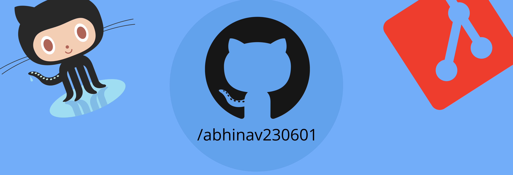

<head>
  <meta name="google-site-verification" content="igq9XKWOOR0tP1GlnZEabnrvXLBk3JNuCE8IXjZ6KMo" />
  <meta name="title" content="Abhinav Dixit abhinav230601" />
<meta name="description" content="Visit Github Profile of abhinav230601 to see Projects and contribution made by Abhinav Dixit. Know more at dixitabhinav.com" />
</head>

  

<h3 align="center">Let's Connect</h3>

  

</a> 

- 👯 I’m looking to collaborate on **MERN Projects**

- 💬 Let's Discuss about **React, NodeJS, Data Structures and Algorithms, and SEO**

- 📫 Reach me at **abhinavdixit2306@gmail.com**

- 📄 Know more about me! [dixitabhinav.com](https://dixitabhinav.com/)

- ⚡ Do you know **A cup of coffee can actually write thousands line of code.**
  
  

<!-- ### Blogs posts -->
<!-- BLOG-POST-LIST:START -->
<!-- BLOG-POST-LIST:END -->

<h3 align="center">Languages and Tools:</h3>

                   

&nbsp;

## Watch my contributions get eaten by a snake 🐍

